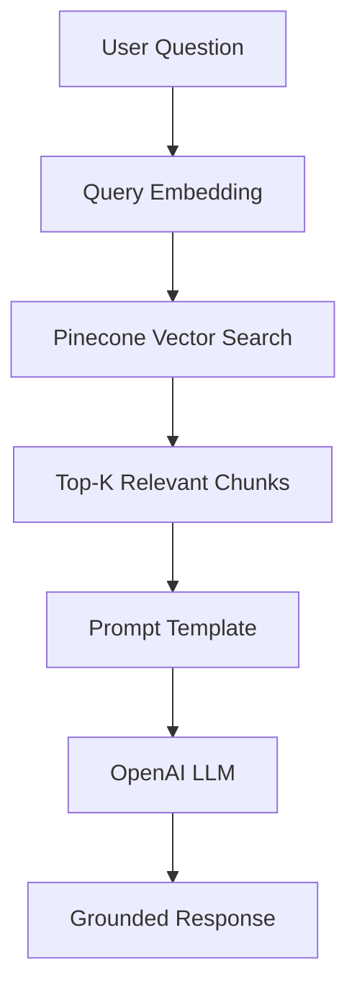

# Retrieval-Augmented Generation (RAG) with Pinecone

**Escuela Colombiana de Ingeniería Julio Garavito**  
**Student:** Santiago Botero García

## Overview

This repository contains the implementation of a **Retrieval-Augmented Generator (RAG)** using:

- OpenAI and Gemini for embeddings and language generation
- Pinecone (local instance) as the vector database
- LangChain (modern Runnable API) for orchestration

The system integrates semantic retrieval with generative AI to produce context-aware, grounded responses based on external documents.

## Repository Structure

```
├── README.md
├── langchain-rag-pinecone.ipynb
└── .gitignore
```

- `langchain-rag-pinecone.ipynb` &rarr; Complete RAG implementation
- `README.md` &rarr; Project documentation
- `.gitignore` &rarr; Environment and dependency exclusions

## Objective of This Repository

The objectives of this laboratory are:

- To understand the architecture of Retrieval-Augmented Generation (RAG)
- To integrate OpenAI embeddings with Pinecone vector storage
- To implement document chunking and semantic search
- To construct a modern LangChain Runnable-based RAG pipeline
- To analyze how retrieval improves factual grounding in LLM responses

## Project Architecture and Components

### High-Level Architecture



### Main Components

| Component                  | Description                                                |
| -------------------------- | ---------------------------------------------------------- |
| **Embeddings**             | Converts text into 1024-dimensional vector representations |
| **Pinecone**               | Stores and indexes document embeddings                     |
| **Retriever**              | Performs similarity search over stored vectors             |
| **Prompt Template**        | Injects retrieved context into model instructions          |
| **OpenAI Chat Model**      | Generates grounded responses                               |
| **LangChain Runnable API** | Orchestrates the pipeline                                  |

## LLM Providers Used

### OpenAI Integration

Uses models such as:

- OpenAI GPT models

Integrated via:

```python
from langchain_openai import ChatOpenAI
```

### Google Gemini Integration

Uses models such as:

- Google AI Studio Gemini models
- `gemini-2.5-flash`
- `gemini-2.5-pro`

Integrated via:

```python
from langchain_google_genai import ChatGoogleGenerativeAI
```

This allows the system to remain **provider-agnostic**, meaning the same chain logic works with different LLM backends.

### Pinecone

Pinecone is used as the vector database.

In this project:

- The index uses cosine similarity
- Embedding dimension: 1024

This enables efficient similarity search over document chunks.

### LangChain (Modern API)

This project uses the **Runnable API (LangChain ≥ 0.3)**:

```python
rag_chain = (
    {"context": retriever, "question": RunnablePassthrough()}
    | prompt
    | llm
)
```

This replaces deprecated abstractions such as:

- `LLMChain`
- `AgentExecutor`

The Runnable pattern is:

- Modular
- Composable
- Future-proof
- Ideal for RAG systems

## Implementation Details

### Document Processing

- Documents are loaded using LangChain loaders
- Text is split into overlapping chunks
- Chunk size improves retrieval precision
- Overlap preserves semantic continuity

### Embedding and Storage

Each chunk:

1. Converted into a vector using OpenAI and Gemini embeddings
2. Stored in Pinecone
3. Indexed using cosine similarity

### Retrieval Mechanism

When a user submits a query:

1. The query is embedded
2. Pinecone retrieves top-k similar chunks
3. Retrieved context is injected into the prompt

The parameter `k` controls retrieval depth.

### Generation Phase

The LLM receives:

- Retrieved context
- The user’s question

The prompt explicitly instructs the model to answer **only using the provided context**, reducing hallucinations.

## Experimental Observations

Experiments were conducted varying:

```
k = 1, 3, 5
```

Observations:

- Small k &rarr; More precise but risk missing context
- Larger k &rarr; More comprehensive but may introduce noise
- RAG significantly reduces hallucinated answers compared to standalone LLM queries

## Key Concepts Learned

This project demonstrates:

- Semantic embeddings
- Vector similarity search
- Retrieval-Augmented Generation
- Prompt grounding
- LangChain modular orchestration
- Practical integration of OpenAI, Gemini and Pinecone

## Conclusion

This project successfully implements a complete Retrieval-Augmented Generator using:

- OpenAI and Gemini for embeddings and generation
- Cloud Pinecone for vector storage
- LangChain for orchestration

The architecture demonstrates how retrieval enhances generative AI by grounding responses in external knowledge sources.

This repository fulfills the laboratory objectives and provides a practical foundation for building scalable, production-grade RAG systems.
