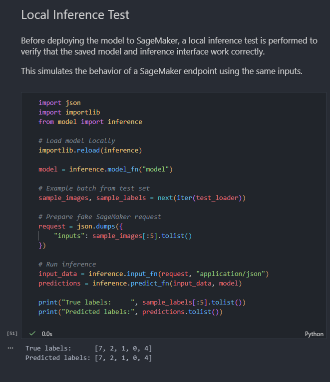

# Exploring Convolutional Layers Through Data and Experiments

**Escuela Colombiana de Ingeniería Julio Garavito**  
**Student:** Santiago Botero García

## Repository Structure and Contents

This repository contains the complete implementation and analysis required for the _Exploring Convolutional Layers Through Data and Experiments_ homework.

```
/
├── README.md
└── Exploring_Convolutional_Layers.ipynb
```

The core deliverable is a single Jupyter Notebook that integrates code, experimental results, and conceptual explanations in a unified and reproducible workflow.

## Exercise Summary

This assignment explores **convolutional neural networks (CNNs)** as architectural components rather than black-box models.  
The goal is to understand how convolutional layers introduce **inductive bias**, how architectural decisions influence learning, and why CNNs are particularly effective for image-based data.

Using the MNIST handwritten digits dataset, this work follows a structured experimental approach that includes:

- Exploratory Data Analysis (EDA) to understand the dataset structure
- A non-convolutional baseline model for comparison
- A custom-designed convolutional architecture
- Controlled experiments isolating a single convolutional design variable
- Interpretation of results from an architectural and theoretical perspective
- Conceptual training and deployment workflow using Amazon SageMaker

The emphasis of this work is not hyperparameter tuning, but **architectural reasoning and interpretability**.

## Dataset Description

The **MNIST** dataset is a public benchmark dataset consisting of grayscale images of handwritten digits.

- **Number of samples:**
  - 60,000 training images
  - 10,000 test images

- **Image dimensions:**
  - 28 x 28 pixels
  - 1 grayscale channel

- **Number of classes:**
  - 10 (digits 0-9)

- **Class distribution:**
  - Approximately balanced across all classes

### Why MNIST is Appropriate for Convolutional Layers

MNIST is well suited for convolutional architectures because:

- It is spatially structured 2D data
- Local patterns such as edges and strokes are meaningful
- Digits exhibit translation invariance
- Global semantics emerge from combinations of local features

These properties align directly with the inductive biases introduced by convolutional layers.

## Methodology Overview

### 1. Dataset Exploration (EDA)

The notebook begins with a minimal but meaningful exploratory analysis:

- Dataset size and train/test split
- Class distribution analysis
- Image dimensions and channels
- Visualization of representative samples from each class
- Normalization using dataset-specific mean and standard deviation

The goal of this section is to understand the **structure of the data**, not to compute exhaustive statistics.

### 2. Baseline Model (Non-Convolutional)

A fully connected neural network was implemented as a baseline reference model:

- Architecture: Flatten &rarr; Dense &rarr; ReLU &rarr; Dense
- Input treated as a 1D vector (no spatial awareness)
- Trained using cross-entropy loss and Adam optimization

The baseline model establishes a point of comparison to highlight the limitations of dense architectures when applied to image-like data.

Reported elements include:

- Model architecture
- Number of trainable parameters
- Training and validation accuracy
- Observed limitations related to spatial structure and generalization

### 3. Convolutional Architecture Design

A convolutional neural network was designed **from scratch**, without copying a tutorial architecture.

Key design choices include:

- Two convolutional layers with increasing channel depth
- Small kernel sizes to capture local spatial patterns
- Padding to preserve spatial dimensions
- ReLU activation functions
- Max pooling to reduce dimensionality and introduce translation invariance

Each architectural decision is explicitly justified in the notebook based on its effect on learning efficiency, inductive bias, and model complexity.

### 4. Controlled Convolutional Experiments

To analyze the impact of a specific architectural choice, a **controlled experiment** was conducted by varying **kernel size** while keeping all other parameters fixed.

Experiment setup:

- Kernel sizes compared: 3x3 vs 5x5
- Same number of layers, filters, optimizer, and training epochs
- Performance evaluated using accuracy and loss

The experiment reports:

- Quantitative results (accuracy and loss)
- Differences in parameter count and computational cost
- Qualitative observations regarding locality and feature abstraction
- Trade-offs between expressiveness and efficiency

This section emphasizes **experimental rigor and isolation of variables**.

### 5. Interpretation and Architectural Reasoning

The final section of the notebook focuses on conceptual understanding, addressing:

- Why convolutional models outperform fully connected baselines
- The inductive biases introduced by convolution (locality, weight sharing, compositionality)
- Scenarios in which convolutional architectures may be inappropriate

This section is intentionally written in explanatory prose, reflecting theoretical understanding rather than implementation details.

## SageMaker Training and Deployment

To simulate a production workflow, the notebook outlines a conceptual deployment using **Amazon SageMaker**:

- Model training using the PyTorch framework
- Packaging of trained model artifacts
- Upload to Amazon S3
- Creation of a SageMaker model and endpoint

Due to IAM permission constraints, the endpoint could not be fully deployed.



However, the preparation steps and deployment logic are fully documented, and local testing demonstrates model correctness.
